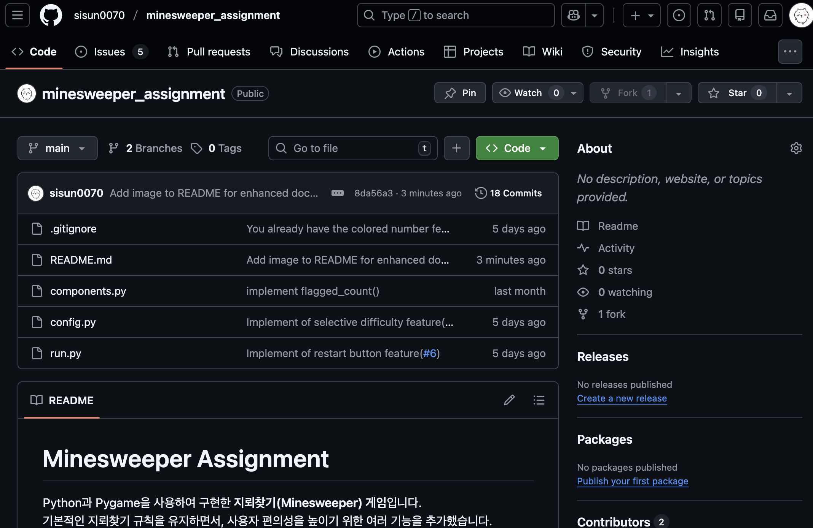

# Minesweeper Assignment

Python과 Pygame을 사용하여 구현한 **지뢰찾기(Minesweeper) 게임**입니다.  
기본적인 지뢰찾기 규칙을 유지하면서, 사용자 편의성을 높이기 위한 여러 기능을 추가했습니다.

---

## 프로젝트 개요

- **언어**: Python  
- **라이브러리**: Pygame  
- **프로젝트 목적**  
  - 지뢰찾기 게임을 구현하며 GitHub 협업 흐름(Issue → Pull Request → Review → Merge)을 경험
  - 기능 단위로 관리되는 프로젝트 구조 이해

---

## 구현된 주요 기능

### 난이도 설정 기능
- 게임 시작 시 **Easy / Normal / Hard** 난이도를 선택할 수 있습니다.
- 난이도에 따라 보드 크기와 지뢰 개수가 자동으로 설정됩니다.
- 각 난이도는 서로 다른 게임 난이도를 제공하도록 설계되었습니다.

### 기본 지뢰찾기 게임 플레이
- 좌클릭: 선택한 칸 열기  
- 우클릭: 지뢰로 예상되는 칸에 깃발 표시  
- 숫자 타일을 통해 주변 지뢰 개수 확인  
- 지뢰 클릭 시 **Game Over**
- 모든 안전한 칸을 열면 **Game Clear**

### 타이머 기능
- 게임 시작과 동시에 플레이 시간이 자동으로 측정됩니다.
- 게임 진행 중 실시간으로 화면에 표시됩니다.
- 게임 오버 또는 게임 클리어 시 타이머가 정지됩니다.

### 게임 재시작 기능
- 키보드 **R 키**를 누르면 현재 게임을 즉시 재시작할 수 있습니다.
- 재시작 시 보드 상태, 지뢰 배치, 타이머, 게임 상태가 모두 초기화됩니다.
- 프로그램을 다시 실행하지 않고 반복 플레이가 가능합니다.

### 힌트 기능 (안전한 칸 표시)
- 키보드 **H 키**를 누르면 아직 열리지 않은 안전한 칸 1개를 표시합니다.
- 플레이 보조를 위한 기능으로 제한적으로 동작합니다.
- 게임 오버 또는 게임 클리어 상태에서는 힌트가 비활성화됩니다.
- 기존 게임 로직에는 영향을 주지 않고 UI 상에서만 동작합니다.

---

## 협업 및 관리 방식 (Project Manager 역할)

- 기능별 **Issue 생성**을 통해 작업 단위 관리
- 기능 구현 후 **Pull Request 생성**
- 코드 리뷰를 통해
  - 변수명 통일
  - 구조 개선
  - 기능 안정성 검토
- 리뷰 완료 후 Pull Request **Merge**
- 프로젝트 전반에 대한 문서화(README) 수행

---

## Game Over

지뢰를 클릭하면 모든 지뢰가 표시되며 게임이 종료된다.

